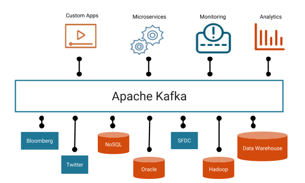

## 1. 카프카의 시작

2011년 링크드인에서는 파편화된 데이터 수집 및 분배 아키텍처를 운영하는데 어려움을 겪었다.

데이터를 생성하는 소스어플리케이션과 데이터가 최종 적제되는 타겟 애플리케이션을 연결하는 아키텍처를 운여했는데, 시간이 지날수록 아키텍처가 거대해지고 소스 애플리케이션과 타겟 애플리케이션이 많아지면서 데이터를 전송하는 라인이 기하급수적으로 복잡해지기 시작했다. 이를 해결하기 위해 새로운 시스템을 만들기로 결정했고 그 결과물이 바로 `아파치 카프카(Apache Kafka)`다.

카프카는 각각의 애플리케이션끼리 연결하여 데이터를 처리하는것이 아니라 한곳에 모아 처리할 수 있도록 **중앙 집중화**한다. 카프카를 통해 웹사이트, 애플리케이션, 센서 등에서 받아온 데이터들을 한 곳에서 실시간으로 관리할 수 있게 만들었다.  

카프카는 대용량 데이터를 수집하고 이를 사용자들이 실시간 스트림으로 소비할 수 있게 만들어주는 일종의 중추 신경으로 동작한다고 볼 수 있다.

## 2. 카프카를 사용하는 이유?

빅데이터로 저장되는 데이터의 종류는 다양하다. 스키마 기반의 정형데이터 부터 그림, 영상, 노래 같은 비정형 데이터가 있다. 이런 방대한 양의 데이터를 기존 데이터베이스로 관리하는 것은 불가능에 가깝기 때문에 이를 저장하고 활용하기 위해서 일단 데이터를 모두 모으는 작업을 하는데 이를 `데이터 레이크`라고 한다.

그러면 서비스에서 발생하는 데이터를 레이크로 모으려면 어떻게 해야할까? 단순히 생각하면 곳 곳에서 발생하는 데이터를 직접 엔드 투 엔드 방식으로 넣을 수 있다. 하지만 서비스 규모가 증가하고 복잡해지면 앞서 말한 링크드인 사례처럼 파편화되고 복잡해지는 문제가 발생한다.

이를 해결하기 위해 추출(extracting),변경(transforming),적재(loading)하는 과정을 정리한 `데이터 파이프라인`을 구축해야 한다.

이때, 데이터 파이프라인을 안정적이고 확장성 높게 운영하기 위한 좋은 방법 중 하나가 바로 아파치 카프카를 활용하는 것이다.

## 3.카프카의 구성요소와 동작

카프카는 발행-구동(pub-sub) 구조를 기반으로 동작하며 크게 Producer, Consumer, Broker로 구성되어 있다.

카프카의 브로커는 토픽을 기준으로 메시지를 관리한다. Producer는 특정 토픽의 메시지를 생성한 뒤 해당 메시지를 브로커에 전달한다. 브로커가 전달받은 메시지를 토픽별로 분류하여 쌓아놓으면, 해당 토픽을 구독하는 컨슈머들이 메시지를 가져가서 처리하게 된다.

카프카는 확장성(scale-out)과 고가용성(high availability)을 위하여 broker들이 클러스터로 구성되어 동작하도록 설계되어있다. 심지어 broker가 1개 밖에 없을 때에도 클러스터로써 동작한다. 클러스터 내의 broker에 대한 분산 처리는 아래의 그림과 같이 [Apache ZooKeeper](http://zookeeper.apache.org/)가 담당한다.

**카프카 클러스터를 3대 이상의 브로커들로 구성해야 하는 이유?**

카프카를 안전하게 운영하기 위해 최소 3대의 브로커를 운영하는 것을 권장하는데, 1대나 2대의 브로커로도 운영할 수 있지만 1대의 브로커로 운영할 경우 브로커의 장애는 서비스의 장애로 이어지기 때문에 테스트의 목적으로만 사용한다.

2대의 브로커로 운영하는 경우 브로커에 장애가 발생하더라도 나머지 브로커가 데이터 처리를 할 수있지만 브로커 간에 데이터가 복제되는 시간 차이로 일부 데이터가 유실 될 가능성이 있다. 이를 막기 위해 min, insync, replicas 옵션을 사용할 수 있다. 이 옵션을 2로 설정하면 최소 2개 이상의 브로커에 데이터가 완전히 복제됨을 보장한다.

## 4. 카프카의 장점

#### 1. 높은 처리량

카프카는 프로듀서 -> 브로커, 브로커 -> 컨슈머의 데이터 이동 과정에서 모두 묶어서 전송한다. 동일한 양의 데이터를 보낼 때 데이터를 묶음으로 인해 전송 횟수를 줄인다면 동일 시간내에 더 많은 양의 데이터를 처리할 수 있다. 많은 양의 데이터를 묶음 단위로 빠르게 처리할 수 있기 때문에 대용량의 실시간 로그데이터를 처리하는데에 적합하다. 또한 파티션의 갯수만큼 컨슈머 갯수를 늘려서 동일 시간당 데이터 처리량을 늘릴 수 있다.

#### 2. 확장성

데이터 파이프라인에서 데이터를 모을 때 들어오는 데이터의 양을 예측하기는 어렵다. 카프카는 이런 가변적인 상황에서 안정적으로 Scale-out, Scale-in 할 수있도록 설계 되었으며 이 과정에서 클러스터의 무중단 운영을 지원하므로 24시간 데이터를 처리해야하는 커머스나 은행같은 비즈니스 모델에서도 적합하게 운영이 가능하다.

#### 3. 영속성

영속성이란 데이터를 생성한 프로그램이 종료되더라도 사라지지 않는 데이터의 특성을 뜻한다. 카프카는 다른 메시징 플랫폼과 다르게 전송 받은 데이터를 메모리에 저장하는것이 아닌 파일시스템에 저장하기 때문에 데이터의 영속성을 유지한다.

#### 4. 고가용성

클러스터로 이루어진 카프카는 데이터의 복제(replication)를 통해 고가용성의 특징을 갖고 있다. 프로듀서로부터 전송받은 데이터를 여러 브로커 중 1대의 브로커에만 저장하는 것이 아니라 또 다른 브로커에도 저장한다. 한 브로커에 장애가 발생하더라도 복제된 데이터가 나머지 브로커에 저장되어 있으므로 저장된 데이터를 기준으로 지속적으로 데이터 처리가 가능하다. 

